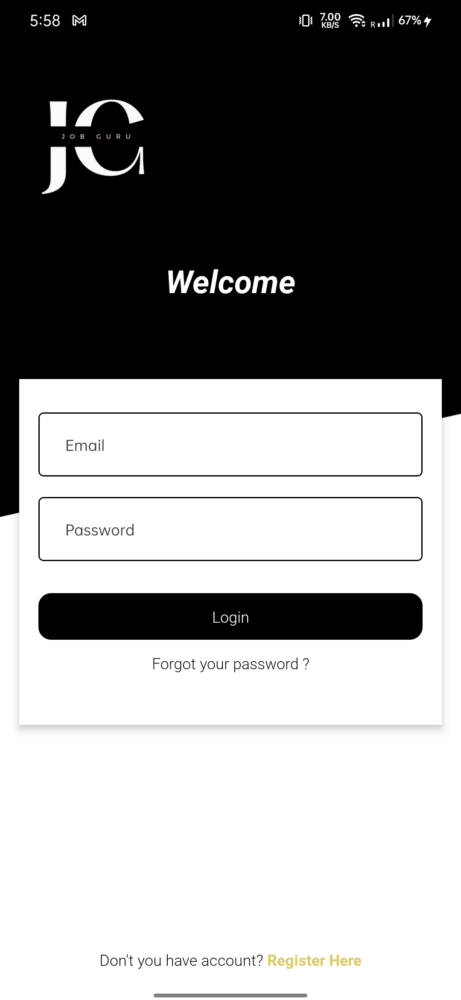

# JobGuru - Your Job Search Companion

## Description

JobGuru is an intuitive application tailored to streamline your job search process. With JobGuru, you can effortlessly find job opportunities that match your skills and preferences. Whether you're a seasoned professional or just starting your career journey, JobGuru is your go-to companion for landing your dream job. It is designed to simplify job hunting by offering a diverse range of job listings with customizable filters. Users can explore opportunities, save favorites, and receive notifications for new openings. It streamlines the search process, empowering users to find relevant job opportunities quickly and efficiently, enhancing their job search experience.  

## Screenshots

  
  
  
  
  

## Features

- Explore job listings from various industries and locations.
- Customize your job search with filters such as job title, location, and company.
- Save favorite listings for future reference.
- Receive notifications for new job openings matching your criteria.

